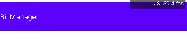
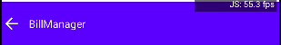

#  AppBar Component

## Compatibility

| 🌏 Web                   | 🖥 Electron              | 📱 React Native    |
| :----------------------: | :----------------------: | :----------------: |
| :heavy_multiplication_x: | :heavy_multiplication_x: | :heavy_check_mark: |

## Screenshots

| 🌏 Web | 🖥 Electron | 📱 React Native                     |
| :----: | :---------: | :---------------------------------: |
| TBD    | TBD         |  |
|        |
| TBD    | TBD         |  |

## Props

| Name       | Type    | Default | Description                                |
| :--------- | :------ | :------ | :----------------------------------------- |
| title      | string  |         | Adds title of Appbar                       |
| styles     | object  |         | It is used for styling Appbar              |
| BackButton | boolean |         | It is used for adding BackButton in Appbar |


## How to use

```react
import React from 'react';
 <AppBar
  title="BillManager"
  BackButton={true}
 />
```

## Tests
