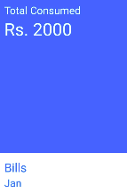

#  BillCard Component

## Compatibility

| 🌏 Web                   | 🖥 Electron              | 📱 React Native |
| :----------------------: | :----------------------: | :-------------: |
| :heavy_multiplication_x: | :heavy_multiplication_x: | ::              |

## Screenshots

| 🌏 Web | 🖥 Electron | 📱 React Native                         |
| :----: | :---------: | :-------------------------------------: |
| TBD    | TBD         |  |

## Props

| Name   | Type   | Default | Description                           |
| :----- | :----- | :------ | :------------------------------------ |
| name   | string |         | It is used for adding billName        |
| month  | string |         | It is used for adding month of bill   |
| budget | number |         | It is used for adding budget of bills |
| style  | object |         | It is used for adding stylesin AppBar |


## How to use

```react
import React from 'react';
<BillCard
      name={"ADNAN "}
      month={"Jan"}
      budget={2000}
    />
```

## Tests

