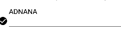

#  FormInput Component

## Compatibility

| 🌏 Web                   | 🖥 Electron              | 📱 React Native    |
| :----------------------: | :----------------------: | :----------------: |
| :heavy_multiplication_x: | :heavy_multiplication_x: | :heavy_check_mark: |

## Screenshots

| 🌏 Web | 🖥 Electron | 📱 React Native                           |
| :----: | :---------: | :---------------------------------------: |
| TBD    | TBD         |  |
|        |


## Props

| Name          | Type     | Default | Description                               |
| :------------ | :------- | :------ | :---------------------------------------- |
| label         | string   |         | It is used for adding label  in component |
| onValueChange | function |         | It is used for changing input value       |
| value         | string   |         | It is used for adding input values        |
| IconSize      | number   |         | It is used for adding Size of Icon        |
| IconName      | string   |         | It is used for adding Name of icon        |
| IconColor     | string   |         | It is used for adding Color of icon       |


## How to use

```react
import React from 'react';
<FormInput
      label={'Name'}
      onValueChange={(e)=>e}
      IconColor={"blue"}
      IconSize={20}
      IconName={"arrow-left"}
    />
```

## Tests
