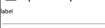

#  FormInput Component

## Compatibility

| 🌏 Web                   | 🖥 Electron              | 📱 React Native    |
| :----------------------: | :----------------------: | :----------------: |
| :heavy_multiplication_x: | :heavy_multiplication_x: | :heavy_check_mark: |

## Screenshots

| 🌏 Web | 🖥 Electron | 📱 React Native                            |
| :----: | :---------: | :----------------------------------------: |
| TBD    | TBD         |  |
|        |


## Props

| Name         | Type     | Default | Description                               |
| :----------- | :------- | :------ | :---------------------------------------- |
| label        | string   |         | It is used for adding label  in component |
| onChangeText | function |         | It is used for changing input value       |
| value        | string   |         | It is used for adding input values        |


## How to use

```react
import React from 'react';
<InputLabel
      label={'Name'}
      value={prop.value}
      onChangeText={(e)=>e}
    />
```

## Tests
