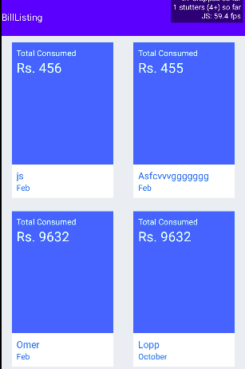

#  BillListing Component

## Compatibility

| 🌏 Web                   | 🖥 Electron              | 📱 React Native    |
| :----------------------: | :----------------------: | :----------------: |
| :heavy_multiplication_x: | :heavy_multiplication_x: | :heavy_check_mark: |

## Screenshots

| 🌏 Web | 🖥 Electron | 📱 React Native                           |
| :----: | :---------: | :---------------------------------------: |
| TBD    | TBD         |  |
|        |

## Props

| Name | Type   | Default | Description                               |
| :--- | :----- | :------ | :---------------------------------------- |
| data | object |         | It is used for adding  BillCards  in Page |

## How to use

```react
import React from 'react';
        <BillListing  data=[{name:'BillName' month="january" budget={2000} }]/>
```

## Tests
