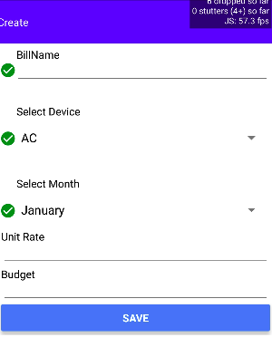

#  BillListing Component

## Compatibility

| 🌏 Web                   | 🖥 Electron              | 📱 React Native    |
| :----------------------: | :----------------------: | :----------------: |
| :heavy_multiplication_x: | :heavy_multiplication_x: | :heavy_check_mark: |

## Screenshots

| 🌏 Web | 🖥 Electron | 📱 React Native                            |
| :----: | :---------: | :----------------------------------------: |
| TBD    | TBD         |  |


## Props

| Name   | Type   | Default | Description                           |
| :----- | :----- | :------ | :------------------------------------ |
| mutate | object |         | It is used for mutation of Data       |
| Name   | string |         | It is used for adding Name  of Bill   |
| month  | string |         | It is used for adding month  of Bill  |
| budget | string |         | It is used for adding budget  of Bill |


## How to use

```react
import React from 'react';
        <CreateBill  name="ADNAN"  month="January" budget={2000}/>
```

## Tests
