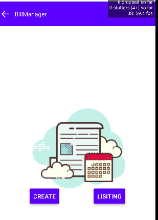

#  BillListing Component

## Compatibility

| 🌏 Web                   | 🖥 Electron              | 📱 React Native    |
| :----------------------: | :----------------------: | :----------------: |
| :heavy_multiplication_x: | :heavy_multiplication_x: | :heavy_check_mark: |

## Screenshots

| 🌏 Web | 🖥 Electron | 📱 React Native                 |
| :----: | :---------: | :-----------------------------: |
| TBD    | TBD         |  |


## Props

| Name    | Type   | Default | Description                    |
| :------ | :----- | :------ | :----------------------------- |
| history | object |         | It is used for routing of Page |


## How to use

```react
import React from 'react';
        <Home />
```

## Tests
